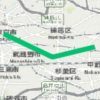
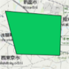

# GIS用語集

## QGIS

https://www.qgis.org/ja/site/

シェープファイルを閲覧，加工できるGISフリーソフトである．


## OSM

https://www.openstreetmap.org/
https://wiki.openstreetmap.org/wiki/Main_Page

OSM(OpenStreetMap)とはフリーで提供されている地図のことである．
OSMのデータはフリーで取得することができる．


## シェープファイル

https://www.esrij.com/gis-guide/esri-dataformat/shapefile/
https://www.esrij.com/cgi-bin/wp/wp-content/uploads/documents/shapefile_j.pdf

図形情報や属性情報がまとまったファイルを指す．
ESRI社が提唱したフォーマットでGISで標準となっている．
シェープファイルには少なくとも下記ファイルが含まれる．

|拡張子|内容|
|---|---|
|.shp|図形情報が格納されている．|
|.dbf|属性情報が格納されている．|
|.shx|図形と属性の対応関係が格納されている．|

現行の制約では，1つのシェープファイルには1つのジオメトリしか格納することができないとなっている．


## ベースマップ

背景地図のことを指す．
ESRIから無償のベースマップが公開されている．

| 地図 | URL |
|---|---|
| 白地図 | https://services.arcgisonline.com/ArcGIS/rest/services/Canvas/World_Light_Gray_Base/MapServer |
| 衛星画像 | https://services.arcgisonline.com/ArcGIS/rest/services/World_Imagery/MapServer |
| 道路地図 | https://services.arcgisonline.com/ArcGIS/rest/services/World_Street_Map/MapServer |
| 起伏図 | https://services.arcgisonline.com/ArcGIS/rest/services/World_Terrain_Base/MapServer |
| 地形図 | https://services.arcgisonline.com/ArcGIS/rest/services/World_Topo_Map/MapServer |


## 空間参照系


## フィーチャ

現実世界の物(標識，道路，建物等)をベクターデータ化したもの．
地物ともいう．
ポイント，ライン，ポリゴンの3種類存在する．


## WKT(Well-known text)

フィーチャをテキスト形式で表現するフォーマット．

|Type|Exanple|Image|
|---|---|---|
|Point|POINT (139.621002802592 35.7119406409266)||
|Line|LINESTRING (139.548599326586 35.7376245768467,139.607394853493 35.7118940200852,139.657922259429 35.7230822398456)||
|Polygon|POLYGON ((139.540790545669 35.7797450710378,139.600504752684 35.7756458256734,139.599126732522 35.741352953488,139.552733387072 35.7424714324349,139.540790545669 35.7797450710378))||

### WKTの実用例

SQL Serverでの実用例を示す．
例えば以下のようなフィーチャを格納するテーブルがあったとする．

```sql
CREATE TABLE SAMPLE_FEATURE(SHAPE geometry NULL);
```

以下のようにWKTからgeometryインスタンスを生成することでフィーチャを登録することができる．

```sql
INSERT INTO SAMPLE_FEATURE(SHAPE) VALUES(geometry::STPointFromText('POINT(135 35)', 4326));
```

DBを確認すると確かにフィーチャが登録されていることがわかる．


```sql
SELECT SHAPE FROM SAMPLE_FEATURE;
```

|SHAPE|
|---|
|0xE6100000010C0000000000E060400000000000804140|


WKT形式でフィーチャを取得することもできる．

```sql
SELECT SHAPE.STAsText() FROM SAMPLE_FEATURE;
```

|SHAPE|
|---|
|POINT(135 35)|

