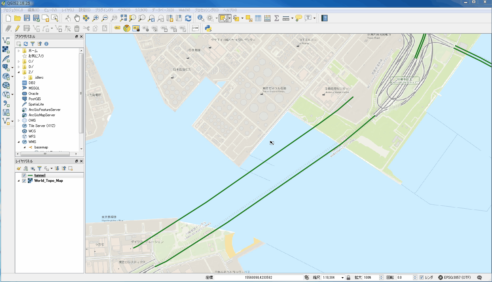

# QGISマニュアル


<!-- TOC -->

- [QGISマニュアル](#qgisマニュアル)
    - [導入](#導入)
        - [QGISとは](#qgisとは)
        - [QGISをインストールする](#qgisをインストールする)
        - [OSMからシェープファイルを取得する](#osmからシェープファイルを取得する)
    - [基本操作](#基本操作)
        - [QGISを起動する](#qgisを起動する)
        - [QGISでプロキシを設定する](#qgisでプロキシを設定する)
        - [ベースマップを表示する](#ベースマップを表示する)
        - [シェープファイルを表示する](#シェープファイルを表示する)
    - [フィーチャ操作](#フィーチャ操作)
        - [フィーチャを選択する](#フィーチャを選択する)
        - [フィーチャの情報を表示する](#フィーチャの情報を表示する)
        - [フィーチャの一覧をテーブルで表示する](#フィーチャの一覧をテーブルで表示する)
        - [フィーチャを抽出する](#フィーチャを抽出する)
        - [フィーチャを描画する](#フィーチャを描画する)
        - [フィーチャを削除する](#フィーチャを削除する)
        - [フィーチャを移動する](#フィーチャを移動する)
        - [フィーチャにノードを追加する](#フィーチャにノードを追加する)
        - [フィーチャからノードを削除する](#フィーチャからノードを削除する)
        - [フィーチャのノードを移動する](#フィーチャのノードを移動する)
        - [フィーチャを結合する](#フィーチャを結合する)
        - [異なるレイヤにフィーチャをコピーする](#異なるレイヤにフィーチャをコピーする)
    - [属性操作](#属性操作)
        - [属性を追加する](#属性を追加する)
        - [属性名を編集する](#属性名を編集する)
        - [属性を削除する](#属性を削除する)
    - [ファイル操作](#ファイル操作)
        - [フィーチャを抽出してシェープファイルに出力する](#フィーチャを抽出してシェープファイルに出力する)
        - [ジオメトリをWKT形式でCSV出力する](#ジオメトリをwkt形式でcsv出力する)
    - [レイヤ操作](#レイヤ操作)
        - [シェープファイルレイヤを新規作成する](#シェープファイルレイヤを新規作成する)
        - [レイヤの表示を切り替える](#レイヤの表示を切り替える)
        - [レイヤの表示順を変える](#レイヤの表示順を変える)
        - [レイヤのスタイルを変更する](#レイヤのスタイルを変更する)
        - [パネルからレイヤを削除する](#パネルからレイヤを削除する)

<!-- /TOC -->

<!-- 導入 -->

## 導入

### QGISとは

シェープファイルを閲覧，加工できるGISフリーソフト．

### QGISをインストールする

https://www.qgis.org/ja/site/forusers/download.html にアクセスし，「QGIS スタンドアローンインストーラVersion 2.18 (64 bit)」をダウンロードする．
ダウンロードしたインストーラーを実行し，QGISをインストールする．


### OSMからシェープファイルを取得する

OSMから無償でシェープファイルが提供されている．
利用するには https://download.geofabrik.de/asia/japan.html にアクセスし，各地域の.shp.zipをダウンロードし，zipファイルを解凍する．


<!-- /導入 -->

<!-- 基本操作 -->

## 基本操作

### QGISを起動する

1. 「QGIS Desktop」を起動する．


### QGISでプロキシを設定する

1. 「設定」->「オプション」の順に進む．
2. 「ウェブアクセスにプロキシを使用する」にチェックを入れ，適宜プロキシ情報を設定し「OK」をクリックする．


### ベースマップを表示する

1. 「ブラウザパネル」->「WMS」で右クリックし「新しい接続」をクリックする．
2. 以下の情報を入力し「OK」をクリックする．

|項目|入力|
|---|---|
|名前|basemap|
|url|https://services.arcgisonline.com/arcgis/rest/services/World_Topo_Map/MapServer/WMTS/1.0.0/WMTSCapabilities.xml|

3. 「WMS」->「basemap」->「World_Topo_Map」の順に進み「GoogleMapsCompatible」をダブルクリックするとベースマップが表示される．


### シェープファイルを表示する

1. シェープファイルをQGISにドラッグ&ドロップする．


<!-- /基本操作 -->


<!-- フィーチャ操作 -->

## フィーチャ操作


### フィーチャを選択する


1. 「領域またはシングルクリックによる地物選択」アイコンをクリックする．
2. クリックまたはドラッグでフィーチャを選択する．


### フィーチャの情報を表示する


1. 「地物情報表示」アイコンをクリックする．
2. 地図上でフィーチャをクリックすると情報がポップアップで表示される．
3. 「地図移動」アイコンをクリックすることで地物情報表示モードが解除される．


### フィーチャの一覧をテーブルで表示する

1. 「属性テーブルを開く」アイコンをクリックする．


### フィーチャを抽出する

1. 「レイヤ」->「フィルタ」の順に進む．
2. クエリを書いたら「OK」をクリックする．


### フィーチャを描画する

1. 編集モードにする．
2. 「地物の追加」アイコンをクリックする．
3. フィーチャを描画する．右クリックでノードを追加できる．左クリックで描画を終了する．
4. 属性を適宜入力し「OK」をクリックする．
5. 保存する．


### フィーチャを削除する

1. 編集モードにする．
2. 結合するフィーチャを選択する．
3. 「選択物の削除」アイコンをクリックする．
4. 保存する．


### フィーチャを移動する

1. 編集モードにする．
2. 「地物の移動」アイコンをクリックする．
3. フィーチャをドラッグで移動する．
4. 保存する．




### フィーチャにノードを追加する

1. 編集モードにする．
2. 「ノードツール」アイコンをクリックする．
3. 編集するフィーチャをクリックする．
4. ノードを追加したい箇所でダブルクリックする．
5. 保存する．


### フィーチャからノードを削除する

1. 編集モードにする．
2. 「ノードツール」アイコンをクリックする．
3. 編集するフィーチャをクリックする．
4. 削除したいノードをクリックしdeleteキーを押す．
5. 保存する．


### フィーチャのノードを移動する

1. 編集モードにする．
2. 「ノードツール」アイコンをクリックする．
3. 編集するフィーチャをクリックする．
4. 移動するノードをドラッグする．
5. 保存する．


### フィーチャを結合する

1. 結合するフィーチャを選択する．
2. 編集モードに切り替え，「編集」->「選択地物の結合」の順に進む．
3. 適宜属性を修正し，「OK」をクリックする．


### 異なるレイヤにフィーチャをコピーする

1. コピー元のレイヤを選択し，コピーするフィーチャを選択し，コピーする．
2. コピー先のレイヤを選択し，編集モードにした後「地物の貼り付け」をクリックする．
3. 保存する．


<!-- /フィーチャ操作 -->


<!-- 属性操作 start -->


## 属性操作


### 属性を追加する

1. 属性テーブルを表示する．
2. 編集モードを有効にする．
3. 「新規フィールド」アイコンをクリックする．
4. 適宜入力し「OK」をクリックする．ただし，名前は10文字までしか設定できない．
5. 保存する．


### 属性名を編集する

1. レイヤを右クリックし「プロパティ」をクリックする．
2. 「フィールド」を選択する．
3. 編集モードにし属性を適宜編集する．
4. 編集モードを解除し保存する．


### 属性を削除する

1. 属性テーブルを表示する．
2. 編集モードを有効にする．
3. 「フィールド削除」アイコンをクリックする．
4. 削除する属性を選択し「OK」をクリックする．
5. 保存する．


<!-- /属性操作 -->


<!-- ファイル操作 -->


## ファイル操作


### フィーチャを抽出してシェープファイルに出力する

1. フィーチャを選択する．
2. 「編集」->「地物のコピー」の順に進み，選択したフィーチャをコピーする．
3. 「編集」->「新規レイヤへの地物貼り付け」->「新規ベクタレイヤ」の順に進む．
4. 下記情報を入力し「OK」をクリックする．

|項目|設定|
|---|---|
|形式|ESRI Shapefile|
|File name|適宜設定すること|
|エンコーディング|UTF-8|


### ジオメトリをWKT形式でCSV出力する

1. フィーチャを選択する．
2. 「編集」->「地物のコピー」の順に進み，選択したフィーチャをコピーする．
3. 「編集」->「新規レイヤへの地物貼り付け」->「新規ベクタレイヤ」の順に進む．
4. 下記情報を入力し「OK」をクリックする．

|項目|設定|
|---|---|
|形式|CSV|
|File name|適宜設定すること|
|エンコーディング|UTF-8|
|レイヤオプションGEOMETRY|AS_WKT|


以上によりジオメトリがWKT形式でCSV出力される．

```text
WKT,id,name
"MULTILINESTRING ((139.677560071465 35.507187898751,139.676989512041 35.5072819664856,139.677126735194 35.5079345583604,139.67813785316 35.5078875248891))","3",鶴見駅東口ロータリー
"MULTILINESTRING ((139.675660614143 35.5085930240661,139.675566724618 35.5080286252204,139.67563894733 35.5077052699277))","4",鶴見駅西口駅前通り
"MULTILINESTRING ((139.672176435163 35.5084414852782,139.673457997168 35.5078226177228,139.674819204269 35.5077106316556,139.674851345744 35.5077058971488,139.674887831127 35.5068057474461),(139.674793941601 35.5091221443813,139.674851345744 35.5077058971488,139.675579452916 35.5075986454321))","1",鶴見駅前通り
"MULTILINESTRING ((139.674756070666 35.5087599883679,139.673607729548 35.5087482301235,139.672618278396 35.5088952080544,139.672618278396 35.5089010871661))","4",鶴見駅前西口裏通り
"MULTILINESTRING ((139.674871627005 35.5083778445443,139.675564965039 35.5082955364058))","5",鶴見駅西口西友前
```

<!-- /ファイル操作 -->


<!-- レイヤ操作 -->


## レイヤ操作

### シェープファイルレイヤを新規作成する

1. 「レイヤ」->「レイヤの作成」->「新規シェープファイルレイヤの作成」の順に進む．
2. タイプ，エンコーディング，空間参照系，フィールドを適宜設定し「OK」をクリックする．


### レイヤの表示を切り替える

1. レイヤのチェックボックスを切り替える．


### レイヤの表示順を変える

1. レイヤをドラッグ&ドロップで並び替える．


### レイヤのスタイルを変更する

1. スタイルを変更したいレイヤを右クリックし「プロパティ」を選択する．
2. 色や幅を適宜設定し「OK」をクリックする．


### パネルからレイヤを削除する

1. レイヤを右クリックし「削除」をクリックする（ただQGISのレイヤパネルからレイヤが削除されるだけでシェープファイルが削除されるわけではない）．


<!-- /レイヤ操作 -->